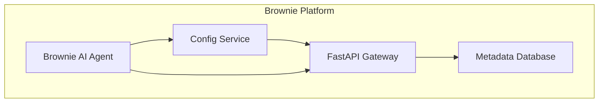

# Agent Documentation

[](https://github.com/longyi-brownie/brownie-metadata-database)
[](https://github.com/longyi-brownie/brownie-metadata-database)

This document provides AI agents (Cursor, Codex, Claude Code etc.) with essential information about the Brownie Metadata Database system architecture, development practices, and quality standards.

> **Version 0.1.0** - Complete enterprise-grade database infrastructure with security, monitoring, and high availability.

## 🎯 System Purpose & Context

### What is Brownie?
**Brownie** is an AI-powered incident assistant platform that helps teams manage and resolve incidents more effectively. This metadata database serves as the **central data backbone** for the entire Brownie ecosystem.

### Brownie Platform Architecture


### Repository Relationships
- **[Brownie Core](https://github.com/longyi-brownie/brownie)** - Main AI incident assistant
- **[Brownie Config Service](https://github.com/longyi-brownie/brownie-config-service)** - Configuration management
- **[Brownie Metadata API](https://github.com/longyi-brownie/brownie-metadata-api)** - FastAPI server (separate repo)
- **This Repository** - Database layer with enterprise features

## 🏗️ System Architecture

### Core Data Model
The database stores critical metadata for the Brownie platform:
- **Organizations** - Multi-tenant organization management
- **Teams** - Team structures, roles, and permissions  
- **Users** - User accounts and authentication
- **Incidents** - Incident tracking and resolution metadata
- **Agent Configs** - AI agent settings and behavior parameters
- **Stats** - System performance and operational metrics

### Database Layer
- **PostgreSQL 16** with SSL/TLS encryption
- **Certificate-based authentication** (zero password auth)
- **Custom Docker image** with pre-configured SSL certificates
- **Alembic migrations** for schema management
- **Enterprise monitoring** with custom metrics

### Security Architecture
- **Zero-trust** for external connections (certificate auth required)
- **Internal Docker network** trusted for service-to-service communication
- **SSL/TLS enforcement** with custom certificates
- **Multi-tenant data isolation** by organization

## 🚀 Key Features

### 1. **Enterprise Security**
- **Certificate-based authentication** (no passwords)
- **SSL/TLS encryption** for all connections
- **Multi-tenant data isolation**
- **Zero-trust architecture**

### 2. **High Availability & Scalability**
- **Kubernetes deployment** with auto-scaling
- **PostgreSQL read replicas** via Patroni
- **Connection pooling** with PgBouncer
- **Automatic failover** capabilities

### 3. **Enterprise Monitoring**
- **Custom metrics collection** (business + technical)
- **Prometheus + Grafana** dashboards
- **Health checks** for all services
- **Performance monitoring** and alerting

### 4. **Developer Experience**
- **Docker Compose** for local development
- **Automated migrations** with Alembic
- **Comprehensive testing** suite
- **CI/CD pipeline** with GitHub Actions

## 🛠️ Development Practices

### Code Quality Standards
**ALWAYS run these commands before committing:**
```bash
# Format code
black .

# Sort imports  
isort .

# Lint code
flake8 .

# Type checking
mypy .
```

### Git Workflow
- **NEVER commit directly to main/develop**
- **ALWAYS use Pull Requests** for code changes
- **Require code review** before merging
- **Run CI/CD pipeline** before merging

### File Structure
```
src/
├── database/          # Database models and connections
├── backup/           # Backup management system
├── logging/          # Structured logging and monitoring
└── certificates/     # Certificate management

scripts/
├── init-db.sql      # Database initialization
├── pg_hba.conf      # PostgreSQL authentication
├── postgresql.conf  # PostgreSQL configuration
└── setup-dev-certs.sh # Certificate generation

k8s/                 # Kubernetes deployment configs
monitoring/          # Enterprise monitoring stack
tests/               # Comprehensive test suite
```

## 🔧 Common Tasks

### Adding New Database Tables
```python
# 1. Create migration
alembic revision --autogenerate -m "Add new table"

# 2. Review generated migration
# 3. Test migration
alembic upgrade head

# 4. Update models in src/database/models/
```

### Adding New Services
```yaml
# 1. Add service to docker-compose.yml
# 2. Create Dockerfile if needed
# 3. Add health checks
# 4. Update CI/CD pipeline
```

### Modifying Authentication
```bash
# 1. Update scripts/pg_hba.conf
# 2. Test with docker-compose down -v && docker-compose up
# 3. Verify SSL connections work
# 4. Update documentation
```

## 🚨 Critical Warnings

### ⚠️ NEVER Do These Things
- **Don't disable SSL** without understanding implications
- **Don't remove certificate authentication** without team discussion
- **Don't commit without running** black, isort, flake8
- **Don't merge directly** to main/develop branches
- **Don't modify** Docker images without testing

### ⚠️ Always Do These Things
- **Run code quality tools** before committing
- **Test with Docker Compose** before pushing
- **Use Pull Requests** for all changes
- **Update documentation** for significant changes
- **Follow security best practices**

## 📚 Important Files

### Configuration Files
- `docker-compose.yml` - Service orchestration
- `Dockerfile.postgres` - Custom PostgreSQL image
- `scripts/pg_hba.conf` - Authentication configuration
- `scripts/postgresql.conf` - PostgreSQL configuration

### Code Files
- `src/database/connection.py` - Database connection management
- `src/certificates/` - Certificate management
- `alembic/env.py` - Migration environment
- `scripts/init-db.sql` - Database initialization

### CI/CD
- `.github/workflows/integration-tests.yml` - Automated testing
- `pyproject.toml` - Python dependencies and configuration

## 🔍 Troubleshooting

### Common Issues
- **SSL connection errors**: Check certificate permissions and paths
- **Migration failures**: Ensure database is healthy before running migrations
- **Permission denied**: Verify file ownership and permissions
- **Container startup issues**: Check logs with `docker compose logs <service>`

### Debug Commands
```bash
# Check service status
docker compose ps

# View logs
docker compose logs postgres
docker compose logs migrate

# Test database connection
docker compose exec postgres psql -U brownie-fastapi-server -d brownie_metadata -c "SELECT version();"

# Check certificate files
docker compose exec postgres ls -la /etc/ssl/postgresql/
```

## 🚀 Deployment Environments

### Development
- **Docker Compose** for local development
- **Development certificates** (self-signed)
- **Hot reloading** for code changes
- **Local monitoring** with Prometheus/Grafana

### Production
- **Kubernetes** with Helm charts
- **Vault PKI** for certificate management
- **High availability** with Patroni
- **Enterprise monitoring** and alerting

## 🎯 Quality Standards

### Code Quality
- **Black formatting** - Consistent code style
- **isort imports** - Organized import statements
- **flake8 linting** - Code quality checks
- **mypy typing** - Type safety

### Security
- **Certificate authentication** - No password auth
- **SSL/TLS encryption** - All connections encrypted
- **Network segmentation** - Internal vs external access
- **Audit logging** - Track all database access

### Reliability
- **Health checks** - Service monitoring
- **Error handling** - Graceful failure management
- **Backup system** - Data protection
- **Testing** - Comprehensive test coverage

## 🔄 Maintenance

### Regular Tasks
- **Update dependencies** monthly
- **Review security** quarterly
- **Test backup/restore** monthly
- **Monitor logs** for issues

### Version Management
- **Semantic versioning** for releases
- **Changelog** for each release
- **Migration compatibility** between versions
- **Documentation updates** with releases

---

**Remember**: This is an enterprise-grade system for a startup. This will be ran in real businesses and corporates. Quality, security, and reliability are paramount. When in doubt, ask questions instead of making assumptions.

## 📖 Additional Resources

### Documentation
- **README.md** - User-facing documentation
- **runbooks/** - Operational procedures
- **monitoring/README.md** - Monitoring setup
- **k8s/README.md** - Kubernetes deployment